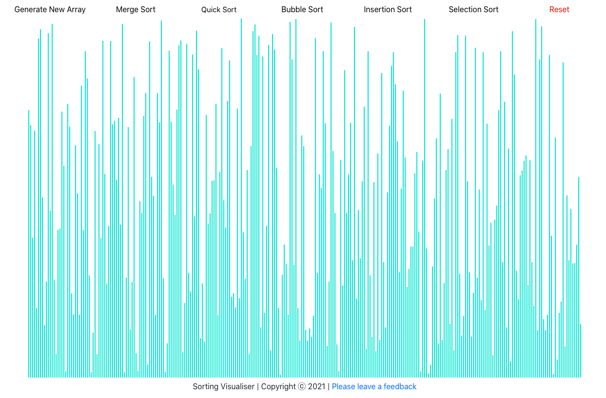

# Sorting Visualiser : Responsive Website to Visualise Sorting Algorithms 
https://still-taiga-99900.herokuapp.com

* Tech Stack : React, Javascript, HTML, CSS and Bootstrap
* Responsive website to visualise sorting algorithms like Merge Sort, Insertion Sort, Bubble Sort, Selection Sort and Quick Sort
* Check the live project at https://still-taiga-99900.herokuapp.com

References :

* Merge Sort : https://www.geeksforgeeks.org/merge-sort/
* Quick Sort : https://www.geeksforgeeks.org/quick-sort/
* Bubble Sort : https://www.geeksforgeeks.org/bubble-sort/
* Insertion Sort : https://www.geeksforgeeks.org/insertion-sort/
* Selection Sort : https://www.geeksforgeeks.org/selection-sort/

